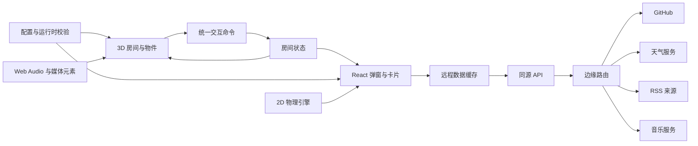

# 3D 交互式个人主页开发总结

> 本次交付将个人主页设计为可交互的 3D 线稿房间：3D 场景负责空间导航和物件交互，React 功能层负责信息展示，边缘函数负责第三方数据代理、缓存与密钥隔离。评审重点是 WebGL 首屏成本、状态与动画的一致性、边缘接口容错，以及键盘和屏幕阅读器用户能否获得等价入口。

## 核心摘要

当前交付包含 95 个 TypeScript、TSX 与 CSS 源码单元，共 9,281 行代码（来源：本地代码统计，2026-08-01）。房间注册了 25 类可交互对象，并接入链接、个人资料、GitHub、RSS、天气、搜索、音乐、主题、音效和文字物理效果。

系统采用 4 层结构：

1. 3D 场景层使用基础几何体和线条程序化绘制房间。
2. 交互状态层统一管理镜头、面板、主题、声音和物件状态。
3. React 功能层承载弹窗、卡片、搜索和播放器。
4. 边缘数据层代理外部服务，统一校验、缓存、超时和错误响应。

本次不包含后台管理系统、数据库、用户认证、离线缓存、可视化场景编辑器和正式的 Web 性能基准测试。

## 系统架构



核心链路为：用户点击房间物件，交互命令修改 Zustand 状态；3D 场景根据状态播放动画，React 功能层根据面板状态展示内容；需要远程数据时，TanStack Query 请求同源接口，边缘函数再访问第三方服务。

## 核心技术栈

| 领域        | 技术                                       | 当前用途                             |
| ----------- | ------------------------------------------ | ------------------------------------ |
| 前端框架    | React 19、React DOM 19                     | 应用结构、弹窗、卡片与播放器         |
| 类型系统    | TypeScript 6                               | 状态、配置、接口与场景对象约束       |
| 构建工具    | Vite 8、pnpm 11                            | 本地开发、分包、生产构建             |
| 3D 渲染     | Three.js、React Three Fiber、Drei          | 正交相机、基础几何、线条、纹理与交互 |
| 视觉效果    | GLSL、后处理 Bloom、GSAP                   | 发光、粒子、镜头过渡与物件动画       |
| 状态管理    | Zustand 5                                  | 房间状态与播放器状态                 |
| 服务端状态  | TanStack Query 5                           | 请求缓存、重试、加载与错误状态       |
| 数据校验    | Zod 4                                      | 配置、客户端响应与第三方响应校验     |
| 物理效果    | Matter.js                                  | 掉落文字、碰撞、拖拽和鼠标扰动       |
| 搜索        | MiniSearch                                 | 站内前缀检索与模糊匹配               |
| XML 解析    | fast-xml-parser                            | RSS 与 Atom 归一化                   |
| UI 基础设施 | Radix UI、Lucide、React Icons              | 弹窗、Tooltip、图标和无障碍语义      |
| 音频        | Web Audio API、HTMLAudioElement            | 合成反馈音、环境音效和音乐播放       |
| 质量保障    | ESLint、Stylelint、Prettier、Vitest、Husky | 静态检查、格式、测试和提交门禁       |

## 模块实现

以下代码均保留完整的输入、关键处理和输出。与 UI 样式无关的属性会省略，但不会只给出无法独立理解的语句片段。涉及网络请求的模块在“完整 API 契约”章节提供方法、路径、请求头、参数、请求体和响应体。

### 1. 3D 线稿场景

房间没有依赖完整的外部 3D 模型。场景使用箱体、圆柱、球体、平面和线段组合家具，再通过基础材质与边缘线构造黑白线稿。暗色主题切换填充色和轮廓色，悬停状态增加强调色和第二层轮廓。

输入是几何体、主题和悬停状态；输出是一个带填充、轮廓和悬停反馈的 Three.js 网格：

```tsx
import { Edges } from '@react-three/drei';
import type { ReactNode } from 'react';

interface LineShapeProps {
  geometry: ReactNode;
  theme: 'light' | 'dark';
  active?: boolean;
  hovered?: boolean;
}

export function LineShape({ geometry, theme, active = false, hovered = false }: LineShapeProps) {
  const fill = theme === 'light' ? '#ffffff' : '#0b0d0f';
  const normalLine = theme === 'light' ? '#000000' : '#f3f4f6';
  const activeLine = theme === 'light' ? '#0e7490' : '#67e8f9';
  const line = hovered || active ? activeLine : normalLine;

  return (
    <mesh>
      {geometry}
      <meshBasicMaterial
        color={fill}
        polygonOffset
        polygonOffsetFactor={2}
        polygonOffsetUnits={2}
        toneMapped={false}
      />
      <Edges color={line} threshold={15} />
      {hovered ? <Edges color={line} scale={1.008} threshold={15} /> : null}
    </mesh>
  );
}
```

交互区域与可见几何分离。输入是对象 ID 和命中区域；点击后输出统一的对象命令：

```tsx
interface InteractionProxyProps {
  objectId: RoomObjectId;
  hitArea: [number, number, number];
}

export function InteractionProxy({ objectId, hitArea }: InteractionProxyProps) {
  return (
    <mesh
      onClick={(event) => {
        event.stopPropagation();
        activateRoomObject(objectId);
      }}
    >
      <boxGeometry args={hitArea} />
      <meshBasicMaterial transparent opacity={0} depthWrite={false} />
    </mesh>
  );
}
```

**核心技术栈**：Three.js、React Three Fiber、Drei、TypeScript、Zustand。

**技术讨论**：程序化几何便于统一线条语言，也能直接把业务状态映射为尺寸、位置和旋转。代价是坐标与家具结构分散在代码中。场景继续扩张时，应把尺寸、锚点和命中区域抽成声明式场景配置，否则调整房间布局会产生连锁修改。

### 2. 房间交互与状态编排

房间状态和播放器状态拆成 2 个 Store。房间 Store 管理镜头、弹窗、主题、声音、选中内容和物件状态；播放器 Store 管理曲目、进度、音量、播放模式和错误状态。远程数据不进入 Store，由 TanStack Query 管理。

下面的 Store 接收“打开哪个面板”和“修改哪些物件字段”作为输入，输出新的不可变状态：

```ts
interface RoomState {
  panel: 'profile' | 'feed' | 'link' | 'music' | 'search' | null;
  selectedFeedId: string | null;
  objectState: RoomObjectState;
  openFeed: (feedId: string) => void;
  patchObjectState: (patch: Partial<RoomObjectState>) => void;
}

export const useRoomStore = create<RoomState>((set) => ({
  panel: null,
  selectedFeedId: null,
  objectState: initialObjectState,

  openFeed: (feedId) => {
    set({ panel: 'feed', selectedFeedId: feedId });
  },

  patchObjectState: (patch) => {
    set((state) => ({
      objectState: { ...state.objectState, ...patch },
    }));
  },
}));
```

物件点击统一进入命令分发层。输入是对象 ID，输出是状态变化、业务面板和声音反馈：

```ts
export function activateRoomObject(objectId: RoomObjectId) {
  const room = useRoomStore.getState();
  const current = room.objectState;

  switch (objectId) {
    case 'mouse': {
      const monitorOn = !current.monitorOn;
      room.patchObjectState({ monitorOn });

      if (!monitorOn) {
        room.setLinkClusterOpen(false);
      }

      playRoomSound('switch', room.isSoundEnabled);
      return;
    }

    case 'weather-doll':
      room.pulseObject('weatherDollPulse');
      room.setWeatherOpen(true);
      playRoomSound('chime', room.isSoundEnabled);
      return;
  }
}
```

脉冲动画使用递增计数器，而不是布尔值。用户连续点击同一个物件时，每次操作都能形成新的动画事件。

**核心技术栈**：Zustand、React Hooks、TypeScript 判别联合类型。

**技术讨论**：集中式命令分发便于核对全部交互，也避免 3D 组件直接依赖业务弹窗。当前 `switch` 已覆盖 25 类对象；继续增加对象时，可改为对象 ID 到命令处理器的注册表，并为每个处理器增加独立测试。

### 3. 动画与按需渲染

画布采用按需帧循环。静态场景不持续占用动画帧；物件发生过渡时主动调用 `invalidate`。全局调度器根据动画类型、设备宽度和减少动态效果设置决定刷新频率。

```tsx
import { useThree } from '@react-three/fiber';
import { useEffect } from 'react';

interface SceneTickerProps {
  airConditionerOn: boolean;
  clockRunning: boolean;
  coffeeSteaming: boolean;
  fanSpeed: 0 | 1 | 2;
  mobile: boolean;
  playback: 'idle' | 'playing' | 'paused';
  reducedMotion: boolean;
  theme: 'light' | 'dark';
}

export function SceneTicker(props: SceneTickerProps) {
  const invalidate = useThree((state) => state.invalidate);

  useEffect(() => {
    const highMotion = props.airConditionerOn || props.fanSpeed > 0 || props.playback === 'playing';
    const ambientMotion = props.clockRunning || props.coffeeSteaming || props.theme === 'dark';

    if (props.reducedMotion || (!highMotion && !ambientMotion)) {
      return;
    }

    const targetFps = highMotion ? (props.mobile ? 30 : 60) : props.mobile ? 15 : 30;
    const frameInterval = 1000 / targetFps;
    let previousTime = 0;
    let frameId = 0;

    const tick = (time: number) => {
      if (!document.hidden && time - previousTime >= frameInterval) {
        previousTime = time;
        invalidate();
      }

      frameId = requestAnimationFrame(tick);
    };

    frameId = requestAnimationFrame(tick);
    return () => cancelAnimationFrame(frameId);
  }, [invalidate, props]);

  return null;
}
```

大部分物件使用基于 `delta` 的阻尼插值，避免动画速度依赖显示器刷新率：

```ts
function animateRotation(currentRotation: number, targetRotation: number, deltaSeconds: number) {
  const smoothing = Math.min(1, deltaSeconds * 5);
  const nextRotation = currentRotation + (targetRotation - currentRotation) * smoothing;
  const stillMoving = Math.abs(targetRotation - nextRotation) > 0.002;

  return { nextRotation, stillMoving };
}

// 每帧调用：
const result = animateRotation(object.rotation.y, open ? -1.15 : 0, delta);

object.rotation.y = result.nextRotation;
if (result.stillMoving) invalidate();
```

**核心技术栈**：React Three Fiber `useFrame`、`requestAnimationFrame`、Three.js `MathUtils`、GSAP。

**技术讨论**：按需渲染适合线稿房间，因为大部分时间场景处于静止状态。暗色主题仍会以 15–30 FPS 驱动环境发光效果，因此并非完全静态。后续应通过真实帧耗时决定是否暂停不可见或低价值的环境动画，而不是只按视口宽度划分质量档位。

### 4. 镜头、加载转场与降级

场景使用正交相机，避免透视缩放破坏线稿构图。镜头预设为总览、工作区和休息区 3 个区域。区域切换时同时插值相机位置和缩放值。

```ts
interface CameraDestination {
  position: readonly [number, number, number];
  target: readonly [number, number, number];
  zoom: number;
}

function moveCamera(
  camera: OrthographicCamera,
  destination: CameraDestination,
  invalidate: () => void,
) {
  const updateCamera = () => {
    camera.lookAt(...destination.target);
    camera.updateProjectionMatrix();
    invalidate();
  };

  const positionTween = gsap.to(camera.position, {
    duration: 0.62,
    ease: 'power2.out',
    x: destination.position[0],
    y: destination.position[1],
    z: destination.position[2],
    onUpdate: updateCamera,
  });

  const zoomTween = gsap.to(camera, {
    duration: 0.62,
    ease: 'power2.out',
    zoom: destination.zoom,
    onUpdate: updateCamera,
  });

  return () => {
    positionTween.kill();
    zoomTween.kill();
  };
}
```

加载器同时观察 WebGL 画布、场景挂载和 Three.js 资源加载。进度到达 100% 后等待 2 个动画帧，再同步执行房间显现与加载层退出。

```ts
interface LoadingState {
  canvasReady: boolean;
  sceneReady: boolean;
  resourceLoading: boolean;
  resourceProgress: number;
  resourceTotal: number;
}

function calculateLoadingProgress(state: LoadingState) {
  if (state.sceneReady && !state.resourceLoading) {
    return 100;
  }

  if (state.resourceTotal > 0) {
    return Math.min(96, Math.round(24 + state.resourceProgress * 0.72));
  }

  return state.canvasReady ? 32 : 8;
}
```

浏览器不支持 WebGL 时，应用显示静态 SVG 预览。用户启用减少动态效果后，镜头直接到达目标位置，加载层也跳过淡出动画。

**核心技术栈**：正交相机、GSAP、Drei 资源进度、Suspense、SVG 降级、`prefers-reduced-motion`。

**技术讨论**：分阶段就绪信号避免画布创建完成但纹理仍未准备好时提前揭示场景。当前静态降级只提供视觉预览，不提供物件的等价业务入口；该问题在无障碍风险中单独说明。

### 5. 发光、后处理与主题

暗色主题启用 Bloom。普通轮廓亮度保持在阈值以下，需要发光的轮廓先生成 HDR 颜色，再由 Bloom 扩散。

```tsx
import { Edges } from '@react-three/drei';
import { Bloom, EffectComposer } from '@react-three/postprocessing';
import { AdditiveBlending, Color } from 'three';

export function GlowingEdges({ color, intensity }: { color: string; intensity: number }) {
  const hdrColor = new Color(color).multiplyScalar(intensity);

  return (
    <Edges
      color={hdrColor}
      blending={AdditiveBlending}
      depthWrite={false}
      toneMapped={false}
      transparent
    />
  );
}

export function DarkThemePostprocessing() {
  return (
    <EffectComposer enableNormalPass={false} resolutionScale={0.5}>
      <Bloom intensity={0.8} luminanceThreshold={1.05} luminanceSmoothing={0.2} mipmapBlur />
    </EffectComposer>
  );
}
```

窗外月光、台灯光束和局部光晕使用自定义 GLSL 遮罩。移动端将后处理分辨率降到 0.35，桌面端使用 0.5；移动端关闭后处理多重采样。月光尘埃数量在桌面端为 56，移动端为 28。

**核心技术栈**：GLSL、Three.js ShaderMaterial、后处理 Bloom、Additive Blending。

**技术讨论**：阈值 Bloom 用较低实现成本获得选择性发光，不需要维护单独渲染层。当前月光遮挡通过固定坐标计算家具阴影；家具位置变化后，光影遮挡必须同步调整。若场景需要自由布局，应改用深度纹理或真实遮挡计算。

### 6. 音效与音乐播放

点击、切换、柔和反馈和提示音使用 Web Audio API 实时合成。系统按音效类型设置频率、波形、起止时间和增益包络。

```ts
type RoomSound = 'click' | 'chime' | 'soft' | 'switch';

let audioContext: AudioContext | null = null;

export function playRoomSound(kind: RoomSound, enabled: boolean) {
  if (!enabled) return;

  audioContext ??= new AudioContext();
  const context = audioContext;
  const now = context.currentTime;
  const notes =
    kind === 'chime'
      ? [880, 1174, 1568]
      : kind === 'switch'
        ? [640, 420]
        : kind === 'soft'
          ? [190]
          : [980];

  notes.forEach((frequency, index) => {
    const oscillator = context.createOscillator();
    const gain = context.createGain();
    const start = now + index * 0.07;
    const duration = kind === 'chime' ? 0.75 : 0.2;

    oscillator.type = kind === 'soft' ? 'sine' : 'triangle';
    oscillator.frequency.setValueAtTime(frequency, start);
    gain.gain.setValueAtTime(0.0001, start);
    gain.gain.linearRampToValueAtTime(0.025, start + 0.01);
    gain.gain.exponentialRampToValueAtTime(0.0001, start + duration);

    oscillator.connect(gain).connect(context.destination);
    oscillator.start(start);
    oscillator.stop(start + duration);
  });
}
```

窗户和空调使用录制音效。系统按音效类型维护当前媒体实例，再次触发时先释放旧实例，避免同类声音重叠。人物语音允许多个短片并行播放，并在播放结束或失败后释放资源。

音乐播放器维护单例 `HTMLAudioElement`。组件折叠、播放列表开关或房间弹窗切换不会中断播放：

```ts
let audio: HTMLAudioElement | null = null;

function playerElement() {
  audio ??= new Audio();
  audio.preload = 'metadata';
  return audio;
}
```

播放器支持列表循环、单曲循环、随机播放、上一首、下一首、进度拖动和音量调整。浏览器拒绝自动播放时，状态转为可重试错误，由用户再次点击恢复。

**核心技术栈**：Web Audio API、HTMLAudioElement、Zustand、TanStack Query。

**技术讨论**：合成短音效减少静态资源数量，也便于主题化调整。录制音效适合需要真实质感的环境动作。当前房间声音不是空间音频，主题声音开关也不会停止已经开始播放的媒体；若需要统一音量、淡入淡出和场景混音，应引入主增益节点和音频总线。

### 7. 玩偶文字与 2D 物理

人物玩偶触发语音时，文字先逐字出现，再把每个字的 DOM 尺寸转换为 Matter.js 矩形刚体。刚体在屏幕边界内下落、碰撞、休眠，并支持鼠标推动和拖拽。

```ts
interface GlyphInput {
  character: string;
  height: number;
  width: number;
  x: number;
  y: number;
}

function createGlyphBody(matter: MatterApi, glyph: GlyphInput) {
  const body = matter.Bodies.rectangle(glyph.x, glyph.y, glyph.width, glyph.height, {
    friction: 0.7,
    frictionAir: 0.018,
    restitution: 0.25,
    sleepThreshold: 30,
    collisionFilter: {
      category: 0x0001,
      mask: 0x0001 | 0x0002,
    },
  });

  matter.Body.setVelocity(body, {
    x: (Math.random() - 0.5) * 1.2,
    y: -4.8,
  });
  matter.Body.setAngularVelocity(body, (Math.random() - 0.5) * 0.2);

  return body;
}
```

物理引擎以 60 FPS 的固定步长更新，DOM 元素通过 `translate3d` 和旋转角度同步位置。桌面端最多保留 120 个字形和 5 个弹出短句，移动端限制为 80 个字形和 4 个短句。超限后先移除最早创建的刚体。

清除操作分 2 步执行：先从物理世界移除刚体并标记退出状态，320 ms 后再删除 DOM 节点，保留消散动画。

**核心技术栈**：Matter.js、动态导入、DOM 测量、`requestAnimationFrame`、Pointer Events。

**技术讨论**：该模块把 3D 场景事件延伸到 2D DOM 层，避免在 Three.js 内实现中文字体刚体。物理引擎虽然采用动态导入，但应用挂载后会立即请求该分包。若首屏网络压力需要继续降低，可延迟到首次玩偶交互后再加载。

### 8. 弹窗、卡片与业务导航

所有信息型功能使用统一弹窗壳层。壳层负责 Portal、遮罩、标题、描述、焦点约束和 Esc 关闭；业务模块只负责查询状态与内容组件。

```tsx
import type { PropsWithChildren } from 'react';
import * as Dialog from 'radix-ui/dialog';

interface ModalShellProps extends PropsWithChildren {
  description: string;
  onOpenChange: (open: boolean) => void;
  open: boolean;
  title: string;
}

export function ModalShell({ children, description, onOpenChange, open, title }: ModalShellProps) {
  return (
    <Dialog.Root open={open} onOpenChange={onOpenChange}>
      <Dialog.Portal>
        <Dialog.Overlay className="dialog-overlay" />
        <Dialog.Content className="dialog-content">
          <Dialog.Title>{title}</Dialog.Title>
          <Dialog.Description>{description}</Dialog.Description>
          <div className="dialog-body">{children}</div>
          <Dialog.Close aria-label="关闭">关闭</Dialog.Close>
        </Dialog.Content>
      </Dialog.Portal>
    </Dialog.Root>
  );
}
```

面板状态使用 `panel + selectedId` 表达，保证同一时间只有一个主业务面板。门对象采用两段式交互：第一次打开房门，第二次弹出随机 RSS 友链确认；跳转统一使用新标签页和 `noopener,noreferrer`。

**核心技术栈**：Radix Dialog、React、Zustand、CSS 自定义属性。

**技术讨论**：3D 层适合表达入口和空间关系，DOM 层更适合呈现文章列表、表单和高密度数据。两层分工避免把可访问文本全部绘制进 WebGL。当前仍缺少可见的 DOM 物件导航菜单，导致部分核心入口只能通过指针点击 3D 场景。

### 9. 站内与外部搜索

搜索索引在应用启动时由链接、RSS 来源和个人资料配置构建。标题权重为正文的 2 倍，同时开启前缀搜索和 0.2 的模糊匹配，最多返回 8 条站内结果。

```ts
import MiniSearch from 'minisearch';

interface SearchDocument {
  content: string;
  id: string;
  kind: string;
  title: string;
  url?: string;
}

export function createSearchIndex(documents: SearchDocument[]) {
  const index = new MiniSearch<SearchDocument>({
    fields: ['title', 'content', 'kind'],
    storeFields: ['id', 'title', 'kind', 'url'],
    searchOptions: {
      boost: { title: 2 },
      fuzzy: 0.2,
      prefix: true,
    },
  });

  index.addAll(documents);

  return {
    search(query: string) {
      if (query.trim() === '') return [];

      return index.search(query.trim()).slice(0, 8);
    },
  };
}
```

结果 ID 同时作为内部导航协议。链接结果打开链接详情，RSS 结果打开对应来源，个人资料结果切换到个人信息面板。外部搜索使用配置中的 URL 模板，并对查询词执行 URL 编码。

**核心技术栈**：MiniSearch、React `useMemo`、配置驱动导航、浏览器导航 API。

**技术讨论**：本地索引不需要服务端搜索，适合当前内容规模。已加载的 RSS 文章尚未写入增量索引，因此目前只能搜索 RSS 来源，不能搜索文章正文。搜索分类也只影响外部引擎，没有过滤站内结果。

### 10. 天气模块

天气面板只在打开时请求数据。默认由边缘节点提供粗粒度位置；请求失败时，用户可以主动授权浏览器定位，再提交经纬度获取结果。

```tsx
interface WeatherQueryProps {
  open: boolean;
  refreshIntervalMs: number;
}

export function useWeatherQuery({ open, refreshIntervalMs }: WeatherQueryProps) {
  return useQuery({
    enabled: open,
    queryKey: ['weather', 'edge-location'],
    queryFn: async () => {
      const response = await fetch('/api/weather', {
        method: 'GET',
        headers: { Accept: 'application/json' },
        credentials: 'same-origin',
      });

      if (!response.ok) {
        throw new Error(`天气请求失败：${String(response.status)}`);
      }

      return weatherResponseSchema.parse(await response.json());
    },
    refetchInterval: open ? refreshIntervalMs : false,
    refetchOnMount: 'always',
    staleTime: 0,
  });
}
```

边缘层将经纬度保留 2 位小数作为缓存键，并发请求实况、7 日预报和地区信息。3 个上游响应全部通过 Zod 校验后才返回客户端。

```ts
async function loadWeatherFromProvider(
  apiHost: string,
  apiKey: string,
  longitude: number,
  latitude: number,
) {
  const location = `${longitude.toFixed(2)},${latitude.toFixed(2)}`;
  const headers = { 'x-qw-api-key': apiKey };

  const currentUrl = `https://${apiHost}/v7/weather/now?location=${location}&lang=zh&unit=m`;
  const forecastUrl = `https://${apiHost}/v7/weather/7d?location=${location}&lang=zh&unit=m`;
  const cityUrl = `https://${apiHost}/geo/v2/city/lookup?location=${location}&lang=zh`;

  const [currentResponse, forecastResponse, cityResponse] = await Promise.all([
    fetch(currentUrl, { method: 'GET', headers }),
    fetch(forecastUrl, { method: 'GET', headers }),
    fetch(cityUrl, { method: 'GET', headers }),
  ]);

  return {
    current: await currentResponse.json(),
    forecast: await forecastResponse.json(),
    city: await cityResponse.json(),
  };
}
```

**核心技术栈**：Geolocation API、TanStack Query、Zod、边缘缓存、Fetch API。

**技术讨论**：默认使用边缘位置，避免页面初始化时直接申请精确定位。设备定位只在用户操作后执行，并允许复用 5 min 内的位置结果。当前界面主要展示实况信息，但边缘层每次同时请求 7 日预报；在预报没有进入 UI 前，这部分请求可以取消或延迟。

### 11. RSS 聚合模块

边缘层兼容 RSS 与 Atom，并把来源差异归一化为标题、摘要、时间、标签、图片和链接。摘要会去除注释和 HTML 标签，再截取前 360 个字符。

```ts
interface RawFeedItem {
  title?: unknown;
  link?: unknown;
  description?: unknown;
  summary?: unknown;
  content?: unknown;
  pubDate?: unknown;
  published?: unknown;
  updated?: unknown;
  category?: unknown;
}

function normalizeFeedItem(item: RawFeedItem, feed: FeedConfig) {
  const title = toPlainText(item.title);
  const url = toPublicHttpsUrl(item.link);

  if (title === '' || url === null) {
    return null;
  }

  const excerpt = toPlainText(item.description ?? item.summary ?? item.content).slice(0, 360);
  const publishedAt = toIsoDate(item.pubDate ?? item.published ?? item.updated);
  const categories = toStringArray(item.category);

  return {
    excerpt,
    feedId: feed.id,
    publishedAt,
    sourceName: feed.name,
    tags: [...new Set([...feed.tags, ...categories])],
    title,
    url,
  };
}
```

服务端限制如下：

- 单个来源响应不超过 5,000,000 字节。
- 单个来源最多返回 20 篇文章。
- 单次最多选择 5 个来源。
- 并发加载上限为 5。
- 单个来源超时为 3,000 ms。
- 只接受公开 HTTPS 地址，拒绝私网地址和自动重定向。

多个来源使用部分成功模型。一个来源失败不会阻断其他来源，响应同时返回文章与来源级失败信息。

**核心技术栈**：fast-xml-parser、Zod、并发 Worker、边缘缓存、Fetch API。

**技术讨论**：解析、跨域和 URL 安全检查放在边缘层，浏览器不直接处理 XML 和 CORS。当前界面一次只展示一个来源，也没有显示来源级失败列表，因此服务端已有的多来源聚合能力尚未完全被前端消费。

### 12. GitHub 与个人资料

个人资料由本地配置直接渲染。GitHub 数据只在用户切换到 GitHub 页签后加载，客户端缓存时间为 15 min。边缘层使用一次 GraphQL 请求获取资料、仓库、关注数据和最近 365 天贡献记录。

```ts
const contributionLevels = {
  NONE: 0,
  FIRST_QUARTILE: 1,
  SECOND_QUARTILE: 2,
  THIRD_QUARTILE: 3,
  FOURTH_QUARTILE: 4,
} as const;

function normalizeGitHubUser(user: GitHubUserResponse) {
  const selectedRepositories =
    user.pinnedItems.nodes.length > 0 ? user.pinnedItems.nodes : user.repositories.nodes;

  return {
    profile: {
      login: user.login,
      name: user.name,
      bio: user.bio,
      avatarUrl: user.avatarUrl,
      url: user.url,
      followers: user.followers.totalCount,
      following: user.following.totalCount,
      publicRepositories: user.publicRepositories.totalCount,
    },
    repositories: selectedRepositories,
    contributions: user.contributionsCollection.contributionCalendar.weeks.flatMap((week) =>
      week.contributionDays.map((day) => ({
        count: day.contributionCount,
        date: day.date,
        level: contributionLevels[day.contributionLevel],
      })),
    ),
  };
}
```

贡献热力图按月份补齐空白日期，并为每个日期提供 Tooltip。贡献次数动画限制在 260–700 ms；用户开启减少动态效果后直接显示最终数值。

**核心技术栈**：GitHub GraphQL、TanStack Query、Radix Tooltip、Zod、`requestAnimationFrame`。

**技术讨论**：GraphQL 将资料、仓库和贡献数据合并为一次上游请求，Token 只存在于边缘环境。静态资料与动态 GitHub 数据分离，第三方服务失败时个人信息仍可浏览。当前热力图按最后一个贡献日期所属自然年绘制，但总数统计最近 365 天，跨年时可能出现图形范围与总数范围不一致。

### 13. 音乐数据与浮动播放器

音乐列表支持本地配置和远程 Meting 两种模式。远程主服务失败后，边缘层按顺序尝试备用服务；成功响应缓存 30 min，并允许 60 min 的陈旧数据回源窗口。

```ts
async function loadPlaylist(providers: string[], query: URLSearchParams) {
  for (const provider of providers) {
    const url = new URL(provider);
    query.forEach((value, key) => url.searchParams.set(key, value));

    try {
      const response = await fetch(url, {
        method: 'GET',
        headers: { Accept: 'application/json' },
      });

      if (!response.ok) continue;

      const payload = await response.json();
      const parsed = metingPlaylistSchema.safeParse(payload);

      if (parsed.success) {
        return parsed.data.map((track, index) => ({
          artist: track.author,
          audio: track.url,
          cover: track.pic,
          id: new URL(track.url).searchParams.get('id') ?? `track-${index + 1}`,
          lyrics: track.lrc,
          title: track.title,
        }));
      }
    } catch {
      // 当前服务失败，继续尝试下一个备用服务。
    }
  }

  throw new Error('所有音乐服务均不可用');
}
```

播放器开始使用后，5,000 ms 无操作会折叠为唱片入口。播放列表和音量面板支持点击外部区域及 Esc 关闭。折叠状态使用 `inert` 和 `aria-hidden`，避免隐藏控件继续进入键盘焦点序列。

**核心技术栈**：TanStack Query、Zustand、HTMLAudioElement、Pointer Events、ARIA。

**技术讨论**：单例媒体元素保证 UI 变化不影响播放连续性。当前歌词字段与显示歌词配置已经进入数据模型，但播放器尚未渲染歌词；音量也只保存在当前会话中。

### 14. 配置驱动与运行时校验

应用信息、链接、个人资料、RSS、搜索、音乐、天气、主题和备案信息都由 JSON 配置驱动。启动阶段使用 Zod 校验配置，并从 Schema 推导 TypeScript 类型。

```ts
import { z } from 'zod';

const linkSchema = z.object({
  id: z.string().regex(/^[a-z\d](?:[a-z\d-]*[a-z\d])?$/),
  title: z.string().min(1),
  image: z.string().regex(/^\/assets\//),
  url: z.url().refine((value) => new URL(value).protocol === 'https:'),
  tags: z.array(z.string().min(1)),
});

export type LinkConfig = z.infer<typeof linkSchema>;

export function parseLinks(rawData: unknown): LinkConfig[] {
  return z.array(linkSchema).parse(rawData);
}
```

同一份配置同时驱动 3D 入口、卡片、搜索索引和边缘服务。无效 URL、非法枚举和缺失字段会在启动或请求阶段被拒绝。

**核心技术栈**：JSON、Zod、TypeScript 类型推导、Vite JSON 导入。

**技术讨论**：该设计接近轻量内容管理系统，同时保留版本控制和类型约束。客户端与边缘层目前分别声明部分 Schema，字段演进时可能出现漂移。后续应提取共享 Schema，并针对可选模块使用局部安全解析，避免单个非核心配置错误阻止整个应用启动。

### 15. API、缓存与边缘路由

浏览器只访问同源 API。统一请求层设置 8,000 ms 超时，并校验成功响应和失败响应。成功响应包含数据、缓存时间、请求 ID 和陈旧标记；失败响应包含错误码、请求 ID、是否可重试和 HTTP 状态。

```ts
import { z } from 'zod';

const responseMetaSchema = z.object({
  cachedAt: z.string(),
  requestId: z.string(),
  stale: z.boolean(),
});

export async function requestApi<T>(
  path: string,
  dataSchema: z.ZodType<T>,
  init: RequestInit = {},
) {
  const controller = new AbortController();
  const timeout = window.setTimeout(() => controller.abort(), 8_000);
  const headers = new Headers(init.headers);

  if (!headers.has('Accept')) {
    headers.set('Accept', 'application/json');
  }

  try {
    const response = await fetch(path, {
      ...init,
      credentials: 'same-origin',
      headers,
      signal: controller.signal,
    });
    const payload: unknown = await response.json().catch(() => null);

    if (!response.ok) {
      const failure = z
        .object({
          error: z.object({
            code: z.string(),
            message: z.string(),
            requestId: z.string(),
            retryable: z.boolean(),
          }),
        })
        .safeParse(payload);

      throw new Error(
        failure.success
          ? `${failure.data.error.code}: ${failure.data.error.message}`
          : `API 请求失败：${String(response.status)}`,
      );
    }

    return z
      .object({
        data: dataSchema,
        meta: responseMetaSchema,
      })
      .parse(payload);
  } finally {
    window.clearTimeout(timeout);
  }
}
```

边缘路由使用路径和方法表分发请求。未知路径返回 404，已知路径的非法方法返回 405。成功响应默认设置 15 min 共享缓存和 60 min 陈旧回源窗口，各业务可以覆盖缓存时间。

本地开发服务器复用同一套路由和处理器，不需要维护另一套 Mock API。该设计缩小了开发环境与边缘运行环境之间的行为差异。

**核心技术栈**：Web Fetch API、AbortController、Cache API、Zod、边缘函数、同源代理。

**技术讨论**：密钥隔离、统一错误和运行时校验降低了第三方接口直接暴露给浏览器的风险。当前缓存命中会直接返回首次生成的请求 ID，`stale` 字段也始终为 `false`；排查缓存问题时，这 2 个元数据不能准确表达本次请求状态。

### 16. 响应式与无障碍处理

移动端通过 JavaScript 与 CSS 双重适配：镜头缩放乘以 0.7，渲染帧率和粒子数量下调，Bloom 分辨率降低，弹窗改为底部布局，浮动播放器缩小。页面使用 `100dvh` 和安全区变量处理移动浏览器地址栏与刘海区域。

动态效果 Hook 实时监听系统偏好：

```ts
import { useEffect, useState } from 'react';

export function useReducedMotion() {
  const [reducedMotion, setReducedMotion] = useState(false);

  useEffect(() => {
    const media = window.matchMedia('(prefers-reduced-motion: reduce)');
    const updatePreference = () => {
      setReducedMotion(media.matches);
    };

    updatePreference();
    media.addEventListener('change', updatePreference);

    return () => {
      media.removeEventListener('change', updatePreference);
    };
  }, []);

  return reducedMotion;
}
```

弹窗、播放器、搜索结果、Tooltip 和加载器具备基础 ARIA 语义。WebGL 画布设置为辅助技术隐藏，因为其中的网格和线条不能直接形成可读的 DOM 结构。

**核心技术栈**：CSS Media Query、动态视口单位、Safe Area、ARIA、Radix UI、`matchMedia`。

**技术讨论**：辅助技术隐藏 WebGL 画布是合理的，但必须提供等价 DOM 控件。当前已有物件控制状态和组件实现，但应用没有挂载该入口。键盘和屏幕阅读器用户无法访问大部分房间物件，这属于当前交付的明确缺口。

## 完整 API 契约

### 1. 通用调用规则

浏览器只调用同源 `/api/*` 接口，不直接携带第三方 Token 或 API Key。

所有 GET 请求使用以下请求头：

```http
Accept: application/json
```

所有 POST 请求使用以下请求头：

```http
Accept: application/json
Content-Type: application/json
```

客户端请求超时时间为 8,000 ms。GET 请求没有请求体；POST 请求体必须是合法 JSON。

所有成功响应使用统一结构：

```json
{
  "data": {},
  "meta": {
    "cachedAt": "2026-08-01T00:00:00.000Z",
    "requestId": "f2e7a498-6d73-4c92-ae5f-0c49355a597f",
    "stale": false
  }
}
```

字段说明：

| 字段             | 类型            | 说明                                     |
| ---------------- | --------------- | ---------------------------------------- |
| `data`           | object          | 当前接口的业务数据                       |
| `meta.cachedAt`  | ISO 8601 string | 响应生成时间                             |
| `meta.requestId` | string          | 请求追踪 ID                              |
| `meta.stale`     | boolean         | 是否返回陈旧缓存；当前实现固定为 `false` |

所有失败响应使用统一结构：

```json
{
  "error": {
    "code": "provider-unavailable",
    "message": "上游服务暂时不可用。",
    "requestId": "f2e7a498-6d73-4c92-ae5f-0c49355a597f",
    "retryable": true
  }
}
```

失败响应头固定包含：

```http
Content-Type: application/json; charset=UTF-8
Cache-Control: no-store
```

### 2. 健康检查

#### 请求

```http
GET /api/health HTTP/1.1
Host: <当前站点域名>
Accept: application/json
```

查询参数：无。

请求体：无。

#### 成功响应

```http
HTTP/1.1 200 OK
Content-Type: application/json; charset=UTF-8
Cache-Control: no-store
```

```json
{
  "data": {
    "status": "ok"
  },
  "meta": {
    "cachedAt": "2026-08-01T00:00:00.000Z",
    "requestId": "b5103633-60f5-40b4-9b43-86373cb146e2",
    "stale": false
  }
}
```

### 3. RSS 文章查询

#### 请求

```http
GET /api/feeds?sources=frontend-weekly,engineering-blog HTTP/1.1
Host: <当前站点域名>
Accept: application/json
```

查询参数：

| 参数      | 位置  | 类型   | 必填 | 约束                               |
| --------- | ----- | ------ | ---- | ---------------------------------- |
| `sources` | query | string | 否   | 逗号分隔的来源 ID，去重后最多 5 个 |

不传 `sources` 时，服务端读取默认启用来源。传入的 ID 必须存在且处于启用状态。

请求体：无。

#### 成功响应

```http
HTTP/1.1 200 OK
Content-Type: application/json; charset=UTF-8
Cache-Control: s-maxage=900, stale-while-revalidate=3600
```

```json
{
  "data": {
    "articles": [
      {
        "excerpt": "文章摘要，最多保留 360 个字符。",
        "feedId": "frontend-weekly",
        "imageUrl": "https://example.com/article-cover.webp",
        "publishedAt": "2026-07-31T08:00:00.000Z",
        "sourceName": "Frontend Weekly",
        "tags": ["前端", "工程化"],
        "title": "文章标题",
        "url": "https://example.com/articles/123"
      }
    ],
    "failures": [
      {
        "feedId": "engineering-blog",
        "message": "Engineering Blog 暂时无法获取。",
        "retryable": true
      }
    ]
  },
  "meta": {
    "cachedAt": "2026-08-01T00:00:00.000Z",
    "requestId": "c1933f82-96b8-4ce6-a3b1-f65f25facade",
    "stale": false
  }
}
```

输出字段：

| 字段          | 类型           | 说明                                           |
| ------------- | -------------- | ---------------------------------------------- |
| `articles`    | array          | 成功获取并归一化的文章，按发布时间倒序         |
| `failures`    | array          | 获取失败的来源；单个来源失败不会使整个请求失败 |
| `imageUrl`    | string \| null | 文章图片；来源没有公开 HTTPS 图片时为 `null`   |
| `publishedAt` | string \| null | ISO 8601 时间；原始时间非法时为 `null`         |

#### 失败响应

一次选择超过 5 个来源：

```http
HTTP/1.1 422 Unprocessable Entity
```

```json
{
  "error": {
    "code": "invalid-request",
    "message": "一次最多选择 5 个订阅源。",
    "requestId": "c1933f82-96b8-4ce6-a3b1-f65f25facade",
    "retryable": false
  }
}
```

来源不存在或已停用：

```json
{
  "error": {
    "code": "invalid-request",
    "message": "选择了无效或已停用的订阅源。",
    "requestId": "c1933f82-96b8-4ce6-a3b1-f65f25facade",
    "retryable": false
  }
}
```

服务端来源配置无效：

```http
HTTP/1.1 503 Service Unavailable
```

```json
{
  "error": {
    "code": "invalid-configuration",
    "message": "订阅源配置无效。",
    "requestId": "c1933f82-96b8-4ce6-a3b1-f65f25facade",
    "retryable": false
  }
}
```

### 4. GitHub 公开数据

#### 请求

```http
GET /api/github HTTP/1.1
Host: <当前站点域名>
Accept: application/json
```

查询参数：无。用户名由服务端配置决定，浏览器不能任意查询其他用户。

请求体：无。

#### 成功响应

```http
HTTP/1.1 200 OK
Content-Type: application/json; charset=UTF-8
Cache-Control: s-maxage=900, stale-while-revalidate=3600
```

```json
{
  "data": {
    "contributions": [
      {
        "count": 3,
        "date": "2026-07-31",
        "level": 2
      }
    ],
    "languages": [
      {
        "bytes": 4,
        "color": null,
        "name": "TypeScript"
      }
    ],
    "profile": {
      "avatarUrl": "https://avatars.githubusercontent.com/u/1",
      "bio": "个人简介",
      "followers": 12,
      "following": 8,
      "login": "example-user",
      "name": "Example User",
      "publicRepositories": 20,
      "url": "https://github.com/example-user"
    },
    "repositories": [
      {
        "description": "仓库简介",
        "forks": 2,
        "language": "TypeScript",
        "name": "example-project",
        "stars": 10,
        "updatedAt": "2026-07-31T00:00:00.000Z",
        "url": "https://github.com/example-user/example-project"
      }
    ]
  },
  "meta": {
    "cachedAt": "2026-08-01T00:00:00.000Z",
    "requestId": "08315fd0-d574-4b26-91ce-8e635676e07b",
    "stale": false
  }
}
```

输出约束：

- `contributions.level` 只能是 0、1、2、3、4。
- `contributions` 覆盖请求发生日前 365 天。
- `repositories` 优先返回置顶仓库，没有置顶仓库时返回最近更新仓库。
- `languages.bytes` 当前实际表示所选仓库中该语言出现的次数，不是代码字节数。

#### 失败响应

服务未配置：

```http
HTTP/1.1 503 Service Unavailable
```

```json
{
  "error": {
    "code": "provider-unavailable",
    "message": "GitHub 服务尚未配置。",
    "requestId": "08315fd0-d574-4b26-91ce-8e635676e07b",
    "retryable": false
  }
}
```

上游请求失败或响应结构非法：

```http
HTTP/1.1 502 Bad Gateway
```

```json
{
  "error": {
    "code": "provider-unavailable",
    "message": "GitHub 数据暂时不可用。",
    "requestId": "08315fd0-d574-4b26-91ce-8e635676e07b",
    "retryable": true
  }
}
```

### 5. 音乐列表

#### 请求

```http
GET /api/music HTTP/1.1
Host: <当前站点域名>
Accept: application/json
```

查询参数：无。

请求体：无。

#### 成功响应

远程音乐模式的响应头：

```http
HTTP/1.1 200 OK
Content-Type: application/json; charset=UTF-8
Cache-Control: s-maxage=1800, stale-while-revalidate=3600
```

```json
{
  "data": {
    "tracks": [
      {
        "artist": "Artist Name",
        "audio": "https://music.example.com/audio/123.mp3",
        "cover": "https://music.example.com/image/123.webp",
        "id": "123",
        "lyrics": "https://music.example.com/lyrics/123.lrc",
        "title": "Track Title"
      }
    ]
  },
  "meta": {
    "cachedAt": "2026-08-01T00:00:00.000Z",
    "requestId": "cd28eb4a-2910-49cb-9382-d9a493d48f01",
    "stale": false
  }
}
```

`cover` 和 `lyrics` 为可选字段。远程列表最多接受 500 首歌曲，上游响应体不能超过 1,500,000 字节。

#### 失败响应

音乐配置无效：

```http
HTTP/1.1 500 Internal Server Error
```

```json
{
  "error": {
    "code": "invalid-config",
    "message": "音乐配置无效。",
    "requestId": "cd28eb4a-2910-49cb-9382-d9a493d48f01",
    "retryable": false
  }
}
```

主服务和备用服务全部失败：

```http
HTTP/1.1 502 Bad Gateway
```

```json
{
  "error": {
    "code": "provider-unavailable",
    "message": "音乐服务暂时不可用。",
    "requestId": "cd28eb4a-2910-49cb-9382-d9a493d48f01",
    "retryable": true
  }
}
```

### 6. 天气查询：边缘位置

#### 请求

```http
GET /api/weather HTTP/1.1
Host: <当前站点域名>
Accept: application/json
```

查询参数：无。

请求体：无。

位置来源：边缘平台附加的城市、区域、经度和纬度。浏览器不在该请求中提交位置。

#### 成功响应

```http
HTTP/1.1 200 OK
Content-Type: application/json; charset=UTF-8
Cache-Control: s-maxage=1800, stale-while-revalidate=1800
```

```json
{
  "data": {
    "current": {
      "feelsLike": "31",
      "humidity": "63",
      "icon": "100",
      "observedAt": "2026-07-31T08:00:00+08:00",
      "temperature": "30",
      "text": "晴",
      "visibility": "20",
      "windDirection": "东南风",
      "windScale": "2"
    },
    "forecast": [
      {
        "date": "2026-08-01",
        "icon": "100",
        "temperatureMax": "33",
        "temperatureMin": "25",
        "text": "晴"
      },
      {
        "date": "2026-08-02",
        "icon": "101",
        "temperatureMax": "32",
        "temperatureMin": "25",
        "text": "多云"
      },
      {
        "date": "2026-08-03",
        "icon": "101",
        "temperatureMax": "31",
        "temperatureMin": "24",
        "text": "多云"
      },
      {
        "date": "2026-08-04",
        "icon": "305",
        "temperatureMax": "30",
        "temperatureMin": "24",
        "text": "小雨"
      },
      {
        "date": "2026-08-05",
        "icon": "305",
        "temperatureMax": "29",
        "temperatureMin": "23",
        "text": "小雨"
      },
      {
        "date": "2026-08-06",
        "icon": "101",
        "temperatureMax": "31",
        "temperatureMin": "24",
        "text": "多云"
      },
      {
        "date": "2026-08-07",
        "icon": "100",
        "temperatureMax": "33",
        "temperatureMin": "25",
        "text": "晴"
      }
    ],
    "location": {
      "city": "上海市",
      "region": "上海市"
    }
  },
  "meta": {
    "cachedAt": "2026-08-01T00:00:00.000Z",
    "requestId": "26a572d0-d487-49cf-8ff0-c09feaddbfed",
    "stale": false
  }
}
```

`forecast` 必须包含 7 条记录。温度、湿度和风力字段保留上游字符串格式，单位由服务端配置决定。

#### 失败响应

边缘请求没有有效经纬度：

```http
HTTP/1.1 422 Unprocessable Entity
```

```json
{
  "error": {
    "code": "location-unavailable",
    "message": "无法获取当前位置。",
    "requestId": "26a572d0-d487-49cf-8ff0-c09feaddbfed",
    "retryable": false
  }
}
```

天气服务未配置：

```http
HTTP/1.1 503 Service Unavailable
```

```json
{
  "error": {
    "code": "provider-unavailable",
    "message": "天气服务尚未配置。",
    "requestId": "26a572d0-d487-49cf-8ff0-c09feaddbfed",
    "retryable": false
  }
}
```

天气上游失败或返回非法结构：

```http
HTTP/1.1 502 Bad Gateway
```

```json
{
  "error": {
    "code": "provider-unavailable",
    "message": "天气数据暂时不可用。",
    "requestId": "26a572d0-d487-49cf-8ff0-c09feaddbfed",
    "retryable": true
  }
}
```

### 7. 天气查询：设备位置

#### 请求

```http
POST /api/weather HTTP/1.1
Host: <当前站点域名>
Accept: application/json
Content-Type: application/json
```

请求体：

```json
{
  "latitude": 31.2304,
  "longitude": 121.4737
}
```

入参约束：

| 字段        | 类型   | 必填 | 约束        |
| ----------- | ------ | ---- | ----------- |
| `latitude`  | number | 是   | -90 至 90   |
| `longitude` | number | 是   | -180 至 180 |

服务端会将经纬度保留 2 位小数，再生成天气缓存键和上游查询参数。

#### 成功响应

成功响应与 GET `/api/weather` 完全一致。

#### 失败响应

请求体不是合法 JSON、字段缺失、类型错误或坐标超出范围：

```http
HTTP/1.1 422 Unprocessable Entity
```

```json
{
  "error": {
    "code": "location-unavailable",
    "message": "无法获取当前位置。",
    "requestId": "26a572d0-d487-49cf-8ff0-c09feaddbfed",
    "retryable": false
  }
}
```

### 8. 路由级错误

访问不存在的 API：

```http
GET /api/unknown HTTP/1.1
Accept: application/json
```

```http
HTTP/1.1 404 Not Found
```

```json
{
  "error": {
    "code": "not-found",
    "message": "请求的接口不存在。",
    "requestId": "6460b8f5-4a1e-485b-b766-809324146842",
    "retryable": false
  }
}
```

对已知接口使用不支持的方法：

```http
POST /api/health HTTP/1.1
Accept: application/json
Content-Type: application/json
```

```http
HTTP/1.1 405 Method Not Allowed
```

```json
{
  "error": {
    "code": "method-not-allowed",
    "message": "请求方法不受支持。",
    "requestId": "6460b8f5-4a1e-485b-b766-809324146842",
    "retryable": false
  }
}
```

## 边缘层第三方 API 调用

以下请求只发生在边缘层。占位符表示服务端持有的值，浏览器不会接触这些凭据。

### 1. GitHub GraphQL

#### 请求

```http
POST https://api.github.com/graphql HTTP/1.1
Accept: application/vnd.github+json
Authorization: Bearer <服务端访问令牌>
Content-Type: application/json
User-Agent: 3d-home-edge-function
```

GraphQL 查询：

```graphql
query GitHubPanel($login: String!, $from: DateTime!, $to: DateTime!) {
  user(login: $login) {
    login
    avatarUrl
    url
    name
    bio
    followers {
      totalCount
    }
    following {
      totalCount
    }
    publicRepositories: repositories(privacy: PUBLIC) {
      totalCount
    }
    repositories(
      first: 6
      privacy: PUBLIC
      ownerAffiliations: OWNER
      orderBy: { field: UPDATED_AT, direction: DESC }
    ) {
      nodes {
        name
        description
        url
        stargazerCount
        forkCount
        updatedAt
        primaryLanguage {
          name
        }
      }
    }
    pinnedItems(first: 6, types: [REPOSITORY]) {
      nodes {
        ... on Repository {
          name
          description
          url
          stargazerCount
          forkCount
          updatedAt
          primaryLanguage {
            name
          }
        }
      }
    }
    contributionsCollection(from: $from, to: $to) {
      contributionCalendar {
        weeks {
          contributionDays {
            date
            contributionCount
            contributionLevel
          }
        }
      }
    }
  }
}
```

请求体：

```json
{
  "query": "<上方 GraphQL 查询文本>",
  "variables": {
    "login": "example-user",
    "from": "2025-08-02T00:00:00.000Z",
    "to": "2026-08-01T00:00:00.000Z"
  }
}
```

超时时间：5,000 ms。

#### 读取的响应字段

```json
{
  "data": {
    "user": {
      "login": "example-user",
      "avatarUrl": "https://avatars.githubusercontent.com/u/1",
      "url": "https://github.com/example-user",
      "name": "Example User",
      "bio": "个人简介",
      "followers": { "totalCount": 12 },
      "following": { "totalCount": 8 },
      "publicRepositories": { "totalCount": 20 },
      "repositories": { "nodes": [] },
      "pinnedItems": { "nodes": [] },
      "contributionsCollection": {
        "contributionCalendar": {
          "weeks": [
            {
              "contributionDays": [
                {
                  "date": "2026-07-31",
                  "contributionCount": 3,
                  "contributionLevel": "SECOND_QUARTILE"
                }
              ]
            }
          ]
        }
      }
    }
  }
}
```

### 2. 天气实况、预报与城市查询

边缘层并发执行 3 个 GET 请求。示例坐标已经保留 2 位小数。

#### 实况天气

```http
GET https://<天气服务域名>/v7/weather/now?location=121.47,31.23&lang=zh&unit=m HTTP/1.1
X-QW-Api-Key: <服务端天气密钥>
```

读取的响应：

```json
{
  "code": "200",
  "now": {
    "feelsLike": "31",
    "humidity": "63",
    "icon": "100",
    "obsTime": "2026-07-31T08:00:00+08:00",
    "temp": "30",
    "text": "晴",
    "vis": "20",
    "windDir": "东南风",
    "windScale": "2"
  }
}
```

#### 7 日预报

```http
GET https://<天气服务域名>/v7/weather/7d?location=121.47,31.23&lang=zh&unit=m HTTP/1.1
X-QW-Api-Key: <服务端天气密钥>
```

读取的单日结构：

```json
{
  "code": "200",
  "daily": [
    {
      "fxDate": "2026-08-01",
      "iconDay": "100",
      "tempMax": "33",
      "tempMin": "25",
      "textDay": "晴"
    }
  ]
}
```

完整响应必须包含 7 条 `daily` 记录。

#### 城市查询

```http
GET https://<天气服务域名>/geo/v2/city/lookup?location=121.47,31.23&lang=zh HTTP/1.1
X-QW-Api-Key: <服务端天气密钥>
```

读取的响应：

```json
{
  "code": "200",
  "location": [
    {
      "adm1": "上海市",
      "adm2": "上海市",
      "name": "黄浦区"
    }
  ]
}
```

3 个请求的单次超时时间均为 5,000 ms。任意请求失败或结构校验失败时，应用 API 返回 502。

### 3. RSS 或 Atom 来源

#### 请求

```http
GET <公开 HTTPS 订阅地址> HTTP/1.1
Accept: application/atom+xml, application/rss+xml, application/xml, text/xml;q=0.9
```

请求体：无。

重定向策略：不自动跟随重定向。

超时时间：3,000 ms。

响应限制：

- HTTP 状态必须为 2xx。
- `Content-Type` 必须是 Atom、RSS 或 XML。
- 响应体不能超过 5,000,000 字节。
- 文章链接和图片链接必须是公开 HTTPS 地址。

RSS 输入示例：

```xml
<rss version="2.0">
  <channel>
    <item>
      <title>文章标题</title>
      <link>https://example.com/articles/123</link>
      <description><![CDATA[<p>文章摘要</p>]]></description>
      <pubDate>Thu, 31 Jul 2026 08:00:00 GMT</pubDate>
      <category>前端</category>
    </item>
  </channel>
</rss>
```

服务端将 XML 转换为 `/api/feeds` 的统一 JSON 输出，不把原始 XML 直接返回浏览器。

### 4. Meting 音乐服务

#### 请求

```http
GET https://<音乐服务域名>/<接口路径>?server=netease&type=playlist&id=<播放列表ID>&r=<随机值> HTTP/1.1
Accept: application/json
```

查询参数：

| 参数     | 类型   | 说明                                    |
| -------- | ------ | --------------------------------------- |
| `server` | string | 音乐平台标识                            |
| `type`   | string | song、playlist、album、search 或 artist |
| `id`     | string | 歌曲、歌单、专辑或歌手 ID               |
| `r`      | string | 用于避免部分服务端缓存碰撞的随机值      |

请求体：无。

请求超时时间：7,000 ms。

读取的响应：

```json
[
  {
    "author": "Artist Name",
    "lrc": "https://music.example.com/lyrics/123.lrc",
    "pic": "https://music.example.com/image/123.webp",
    "title": "Track Title",
    "url": "https://music.example.com/audio/123.mp3"
  }
]
```

响应必须包含 1–500 条记录，音频地址必须是 HTTPS，响应体不能超过 1,500,000 字节。主服务失败后，边缘层按顺序请求备用服务。

## 工程化与交付验证

构建目标为 ES2023，生产环境生成 Source Map。依赖按 React 运行时、Three.js 运行时、Matter.js 和业务代码拆分。Three.js 运行时保持为单独 Vendor Chunk，便于长期缓存，但其体积仍占首屏 JavaScript 的主要部分。

2026-08-01 本地验证结果：

| 检查项              | 结果 | 验证数据                           |
| ------------------- | ---- | ---------------------------------- |
| ESLint 与 Stylelint | 通过 | 0 个错误，0 个警告                 |
| TypeScript          | 通过 | 项目引用构建完成                   |
| Prettier            | 通过 | 全部匹配文件符合格式               |
| Vitest              | 通过 | 2 个测试单元，8 个测试用例全部通过 |
| 生产构建            | 通过 | 转换 2,637 个模块，构建耗时 1.11 s |

生产构建体积如下。数据仅统计编译产物，不包含公开目录中的音频、字体和图片。

| 产物            |    原始体积 | Gzip 体积 |
| --------------- | ----------: | --------: |
| Three.js 运行时 | 1,105.98 kB | 304.12 kB |
| React 运行时    |   268.58 kB |  88.93 kB |
| 业务 JavaScript |   349.65 kB | 113.96 kB |
| Matter.js 分包  |    83.89 kB |  26.28 kB |
| CSS             |    35.54 kB |   7.54 kB |

首屏预加载 JavaScript 的 Gzip 体积约为 507.4 kB。Matter.js 为异步分包，Gzip 体积为 26.3 kB。公开静态资源共 2,202,271 字节，其中音频 976,867 字节、字体 933,448 字节、图片 291,956 字节（来源：本地构建与资源统计，2026-08-01）。

测试当前覆盖接口契约和边缘路由，包括完整响应、缺失字段、非法时间、404、405 和未配置第三方服务。测试尚未覆盖 3D 物件交互、镜头动画、播放器事件、物理效果、弹窗行为和移动端布局。

验证环境实际使用 Node.js 24.9.0，而项目声明要求 24.11.0 至 24.x。所有检查均通过，但该版本偏差仍需在 CI 或本地环境中修正。

## 核心取舍

| 决策                        | 选择原因                         | 放弃的能力或代价               |
| --------------------------- | -------------------------------- | ------------------------------ |
| 程序化几何代替完整模型      | 统一线稿风格，状态可直接驱动几何 | 坐标维护成本随场景规模增加     |
| 正交相机代替透视相机        | 保持室内插画构图和线条比例       | 空间纵深感弱于透视投影         |
| 按需渲染代替固定 60 FPS     | 静态场景减少无效帧               | 每个动画都必须正确触发刷新     |
| Zustand 管理交互状态        | 场景外也能直接触发命令           | 命令与状态规模扩大后需要分域   |
| TanStack Query 管理远程数据 | 复用缓存、重试和状态模型         | 增加运行时依赖与查询键管理成本 |
| 边缘代理第三方服务          | 隔离密钥、处理 CORS、统一缓存    | 部署环境与边缘平台形成依赖     |
| Zod 执行运行时校验          | 阻止无效配置和响应进入 UI        | 客户端与边缘端存在重复 Schema  |
| Web Audio 合成短音效        | 减少音频资源并便于参数调整       | 无法替代真实环境录音的质感     |

## 风险与应对

### P1：3D 首屏包体偏高

风险：首屏预加载 JavaScript 为 507.4 kB Gzip。

影响：按 1.6 Mbps 下行带宽计算，JavaScript 理论传输时间约 2.5 s，尚未包含连接、解析、解压和纹理加载时间。低端移动设备还需要承担 Three.js 初始化成本。

应对：以 507.4 kB 作为当前基线；增加 Lighthouse 与真实设备测试；延迟非首屏后处理和业务模块；评估减少 Drei 子模块、纹理和字体的加载范围。

### P1：3D 交互缺少等价键盘入口

风险：WebGL 画布对辅助技术隐藏，DOM 物件菜单没有挂载。

影响：键盘和屏幕阅读器用户无法进入大部分核心功能；WebGL 降级用户只能看到静态预览。

应对：挂载可折叠的房间物件列表；复用统一命令分发；为每个 3D 入口提供按钮名称、当前状态和键盘操作；将静态降级与该列表同时展示。

### P1：测试集中在数据层

风险：当前只有 8 个测试，未覆盖 3D、播放器、物理和主要 UI 交互。

影响：对象命令、镜头刷新、动画退出和弹窗状态发生回归时，现有测试不能阻止交付。

应对：优先增加命令分发单元测试、播放器媒体事件测试、弹窗交互测试和 3D 对象渲染测试；再增加移动端与减少动态效果的端到端用例。

### P2：缓存元数据不反映实际命中状态

风险：缓存响应沿用首次请求 ID，陈旧标记固定为 `false`。

影响：日志无法根据响应元数据区分新鲜回源、缓存命中和陈旧数据，第三方故障期间的排查成本增加。

应对：缓存仅保存业务数据；每次响应重新生成请求 ID、缓存时间与陈旧状态；在边缘日志中记录缓存结果。

### P2：客户端与边缘 Schema 重复

风险：相同业务结构在多个运行边界重复定义。

影响：字段新增或重命名时，任一端漏改都会产生运行时拒绝或接口漂移。

应对：提取共享 Schema；类型从 Schema 统一推导；为每个接口保留完整响应与非法响应契约测试。

### P2：运行时版本与声明不一致

风险：验证环境使用 Node.js 24.9.0，低于声明的 24.11.0。

影响：当前构建通过，但本地、CI 与部署环境无法证明使用相同运行时语义。

应对：将本地和 CI 固定到 24.11.0 以上；如果 24.9.0 也需要支持，则完成兼容验证后调整版本约束。

## 后续迭代建议

1. 补齐 DOM 物件导航和键盘交互，先解决核心功能不可达问题。
2. 建立首屏包体、LCP、INP、CLS、WebGL 帧耗时和内存占用基线。
3. 将文字物理引擎延迟到首次交互后加载，并按设备性能动态调整上限。
4. 提取共享接口 Schema，修正缓存元数据和 GitHub 热力图统计范围。
5. 增加 3D 命令、播放器、弹窗和移动端端到端测试。
6. 补齐歌词、天气预报、RSS 部分失败和个人经历等已有数据的展示链路。

## 总结

本次开发完成了从空间化入口、状态编排、业务卡片到边缘数据代理的完整链路。3D 场景没有停留在视觉展示层，25 类物件已经与个人资料、内容聚合、天气、音乐、搜索和主题状态建立关联。

当前质量门禁全部通过，接口契约和边缘路由具备基础自动化验证。下一阶段的优先级不应继续增加物件数量，而应先处理键盘可达性、3D 首屏成本、跨层 Schema 复用和交互测试覆盖。
